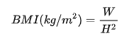
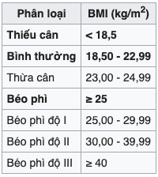

# Buổi 7

# Bài tập về nhà
- Viết ứng dụng tính chỉ số BMI (chỉ số khối của cơ thể)
Công thức: 

- Sau khi tính được chỉ số BMI, hãy so sánh với bảng phân loại và đưa ra lời khuyên cho user

## Lưu ý
- Giao diện tự thiết kế: tối thiểu có 1 UITextField, 1 UIButton, 1 UILabel
- Có thể sử dụng alpha để làm mờ một đối tượng không muốn hiển thị
- Có thể sử dụng isHidden = true để ẩn một đối tượng, 

# Yêu cầu
    - Bài tập đẩy lên Github, gửi link bài tập qua Mail
    - Cú pháp gửi bài:
        [BTVN-07] + Họ tên người gửi + lớp di động 4
    - Gửi bài tập vào mail: quynh@techmaster.vn
    - Khuyến khích viết README.md mô tả repository của mình

## Nội dung
- Chữa bài tập về nhà buổi 6

