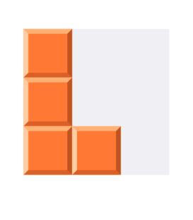

# Buổi 13

# Bài tập về nhà
- Vẽ viên gạch 1 ô vuông viên gạch, sử dụng CAShapeLayer()

## Lưu ý
- Keyword: layer, subLayer, CAShapeLayer, UIBerizePath

# Yêu cầu
    - Bài tập đẩy lên Github, gửi link bài tập qua Mail
    - Cú pháp gửi bài:
        [BTVN-13] + Họ tên người gửi + lớp di động 4
    - Gửi bài tập vào mail: quynh@techmaster.vn
    - Khuyến khích viết README.md mô tả repository của mình

## Nội dung
- Học một số cách thêm shadow
- Thêm layer

