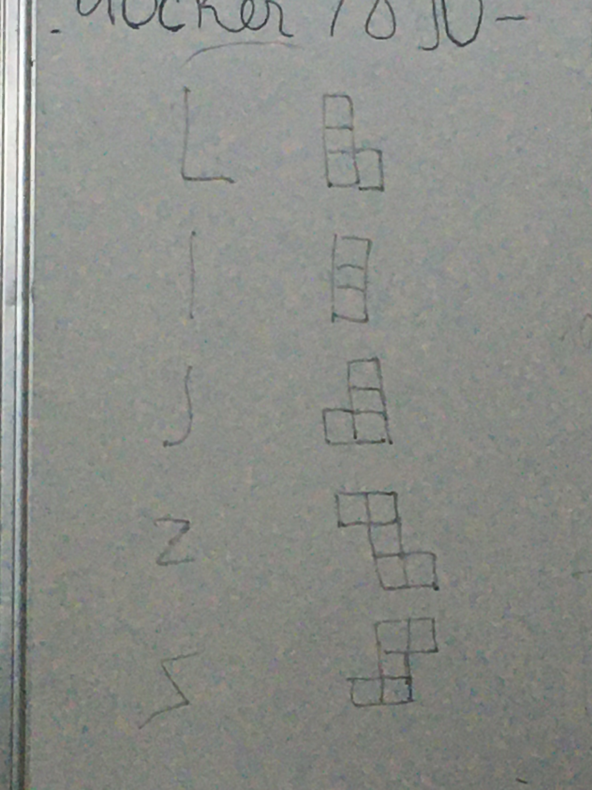

# Buổi 14

# Bài tập về nhà
- Dựa vào việc customView, vẽ các viên gạch hình chữ L, I, J, Z, Z lật ngược

## Lưu ý
- Keyword: layer, subLayer, CAShapeLayer, UIBerizePath
- Sử dụng vòng lặp để vẽ

# Yêu cầu
    - Bài tập đẩy lên Github, gửi link bài tập qua Mail
    - Cú pháp gửi bài:
        [BTVN-14] + Họ tên người gửi + lớp di động 4
    - Gửi bài tập vào mail: quynh@techmaster.vn
    - Khuyến khích viết README.md mô tả repository của mình

## Nội dung
- Học custom một đối tượng

