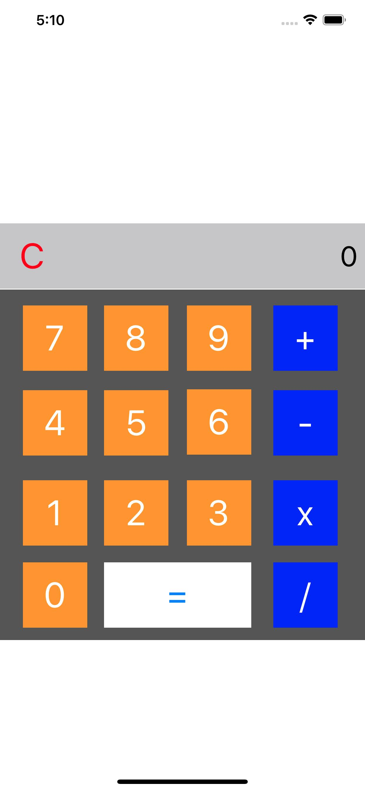

# Buổi 15

# Bài tập về nhà
1. Làm bài 8 quân hậu, hiển thị 8 quân hậu lên bàn cờ 8 x 8 sao cho các quân hậu không được đặt cùng một hàng, dọc, hàng ngang, hay đường chéo. Làm tất cả các trường hợp
2. Viết ứng dụng máy tính bỏ túi

## Lưu ý
   

# Yêu cầu
    - Bài tập đẩy lên Github, gửi link bài tập qua Mail
    - Cú pháp gửi bài:
        [BTVN-15] + Họ tên người gửi + lớp di động 4
    - Gửi bài tập vào mail: quynh@techmaster.vn
    - Khuyến khích viết README.md mô tả repository của mình

## Nội dung đã học
- Đánh tag cho UIView
- Xoá 1 view từ superView
- Thêm gesture tap cho UIView
    

